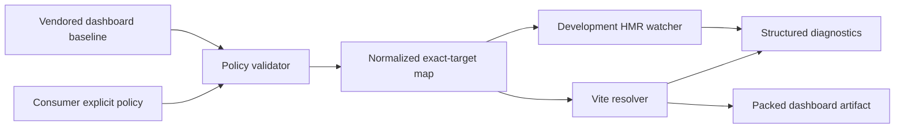
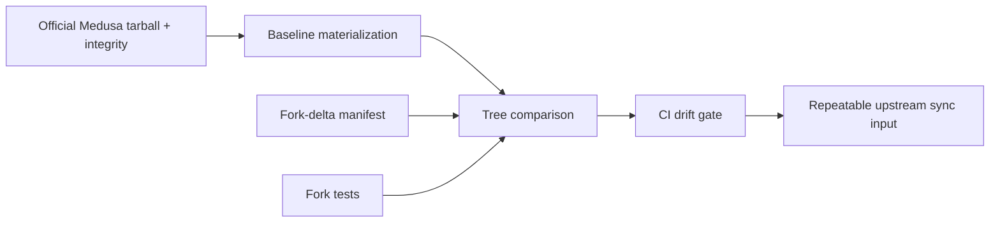
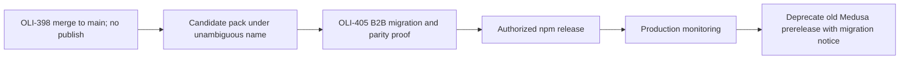

# refactor: Contain and retire implicit dashboard overrides

## Goal Capsule

Turn the standalone Medusa Dashboard fork into a bounded, auditable compatibility package: component replacements are explicitly allowlisted and observable, the fork-owned delta from Medusa is machine-checkable, consumers use one package-owned override mechanism, and the ambiguous `@mantajs/dashboard` npm identity has a non-destructive migration path. OLI-398 targets `main`, prepares but does not publish a package, and leaves the currently deployed B2B installation untouched until the dedicated B2B migration in OLI-405.

---

## Product Contract

### Problem Frame

The repository vendors the complete Medusa Dashboard source and currently replaces any matching dashboard module discovered under `src/admin/components/`. Matching starts from a basename and only adds directory specificity when Medusa has duplicate names. This makes a local file an implicit interception instruction, couples the plugin to Medusa private source paths, and gives production no durable record of which replacements were configured, applied, rejected, or left unmatched.

The package is also published as `@mantajs/dashboard`, the same npm name used by the generic Mantajs dashboard line. B2B consumes the Medusa fork both as a direct dependency and as a Yarn replacement for `@medusajs/dashboard`; a second B2B-local production override mechanism has existed alongside the package plugin. That topology must be simplified without changing the deployed B2B application inside this repository.

### Requirements

- **R1 — Explicit policy:** A component is replaceable only when an explicit configuration entry names both the consumer override module and the exact vendored dashboard target module. Directory scanning or filename equality alone must never authorize a replacement.
- **R2 — Fail closed:** Duplicate targets, paths outside approved roots, missing override files, missing dashboard targets, ambiguous mappings, and undeclared attempted replacements fail the production build with actionable diagnostics.
- **R3 — Observable behavior:** The plugin emits stable structured diagnostics for policy loading, accepted entries, applied replacements, rejected entries, and configured-but-unmatched entries. Development output is readable and production/CI can persist a machine-readable summary without including secrets or source contents.
- **R4 — One package mechanism:** `customDashboardPlugin` is the sole implementation of component replacement in this repository. It owns validation, resolution, HMR invalidation, and diagnostics from the same normalized policy. No alternative alias, filename hook, or environment-specific resolver is introduced.
- **R5 — Development/production parity:** The same allowlist and exact-target resolution decide behavior in development, preview, packed-consumer, and production builds. HMR may differ operationally, but it cannot broaden authorization.
- **R6 — No deep-import contract:** Packed consumers resolve only declared package exports and configured project files. No consumer contract imports `src/`, `dist/` internals, or Medusa private dashboard modules directly.
- **R7 — Reduced, checked fork delta:** Medusa baseline provenance and every fork-owned delta are machine-readable. An upstream check detects undeclared additions, removals, or modifications and gives maintainers a reproducible sync workflow.
- **R8 — Non-destructive namespace transition:** The Medusa fork is prepared under the unambiguous future identity `@mantajs/medusa-dashboard`. The existing published `@mantajs/dashboard@0.1.18-medusa.0` remains available and is not deprecated or overwritten in OLI-398; publication and npm deprecation require later authorization and successful OLI-405 migration.
- **R9 — B2B continuity:** OLI-398 makes no B2B repository change. The current exact published package remains the rollback path until OLI-405 proves the new package, explicit policy, single override mechanism, and development/production parity in B2B.
- **R10 — No release side effect:** The ticket may build and pack candidate artifacts, but must not publish npm, create a GitHub Release, deprecate a package version, or alter a production deployment.

### Acceptance Examples

- **AE1:** A consumer adds `src/admin/components/order-summary.tsx` without an allowlist entry; the dashboard uses the vendored component and reports that the local file is not authorized rather than intercepting it.
- **AE2:** An allowlist entry maps a project file to one exact vendored target; development, preview, and a production build all apply that same replacement and report the same target identity.
- **AE3:** An entry names a target removed by a Medusa update; the build fails before emitting a distributable artifact and names the stale policy entry.
- **AE4:** Two entries name the same target; validation fails deterministically rather than using filesystem or alphabetical order.
- **AE5:** A disposable consumer installs the packed candidate through the intended Yarn alias topology, imports root/CSS/components/hooks/Vite-plugin exports, and builds without any deep import.
- **AE6:** An undeclared edit to the vendored Medusa source makes the upstream-delta gate fail with the changed path and the missing delta declaration.
- **AE7:** The current B2B deployment continues resolving `@mantajs/dashboard@0.1.18-medusa.0` until OLI-405; merging OLI-398 alone cannot change its dependency graph.

### Scope Boundaries

In scope:

- An exact-target component override policy, validation, resolution, HMR parity, and diagnostics.
- One package-owned component override implementation and packed-artifact proof.
- Machine-readable upstream baseline/delta contracts and a repeatable sync/check workflow.
- Preparing the source package, documentation, and release guards for the `@mantajs/medusa-dashboard` identity.
- Documentation and CI gates required to hand a release candidate to OLI-405.

### Deferred to Follow-Up Work

- **OLI-405:** change the B2B dependency, Yarn alias, plugin configuration, and component allowlist; delete the B2B-local production override mechanism; prove B2B development/production parity and zero deep imports.
- After OLI-405 is green and release authorization is explicit: publish the new package, migrate the deployed B2B environment, monitor it, then deprecate only the Medusa-specific versions of `@mantajs/dashboard` with a migration message. Never deprecate or overwrite the generic `0.2.x` line.
- Removing the full vendored source entirely in favor of future official Medusa extension points, when those extension points cover every still-required B2B replacement.

Out of scope:

- Any B2B source, lockfile, deployment, or production configuration change.
- npm publication, npm deprecation, GitHub Release creation, or deployment.
- New dashboard features, route behavior, menu behavior, or visual redesign.
- Editing `UPSTREAM.md`; its existing historical record remains unchanged.

---

## Planning Contract

### Key Technical Decisions

- **KTD1 — Exact target pairs replace implicit discovery** (session-settled: user-directed — chosen over recursive basename matching because a filename must not silently become authorization to replace framework internals). Each entry binds one project-relative override file to one package-relative vendored target; the policy is normalized once and reused by resolution and HMR.
- **KTD2 — New candidate behavior has zero implicit component overrides** (session-settled: user-directed — chosen over a compatibility fallback because the required final state is auditable and fail-closed). Existing B2B remains compatible by continuing to run the already-published `0.1.18-medusa.0` until OLI-405, not by carrying hidden legacy scanning into the candidate.
- **KTD3 — Diagnostics are part of the compatibility contract.** A stable event schema records mode, policy entry, normalized target, result, and reason. Production emits a deterministic summary artifact or callback payload; development may additionally render concise logs. Absolute host paths and file contents are excluded.
- **KTD4 — One normalized policy drives all modes.** Development HMR watches only declared override files and targets. Preview, production, and packed consumers invoke the same validator and resolver; mode-specific plugins cannot reinterpret the allowlist.
- **KTD5 — Rename before release, deprecate after migration** (session-settled: user-directed — chosen over reusing `@mantajs/dashboard` because the shared name conflates an application-specific Medusa fork with the generic Mantajs package). OLI-398 prepares `@mantajs/medusa-dashboard` without publishing. The old Medusa prerelease remains installable until OLI-405 and an authorized rollout complete.
- **KTD6 — Upstream delta is data, not reviewer memory.** A baseline manifest pins the official package, tarball integrity, and tag; a delta manifest enumerates each fork-owned changed path, rationale, owner surface, and proving tests. CI compares the vendored tree to an independently materialized baseline and rejects undeclared drift.
- **KTD7 — OLI-405 owns cross-repository convergence.** This ticket proves the package contract in a disposable consumer but does not edit B2B. “One mechanism, zero deep imports, and dev/prod parity” becomes a cross-repo exit gate completed only when OLI-405 removes the B2B-local resolver.

### High-Level Technical Design

### System-Wide Impact

- **Dashboard maintainers:** gain a reviewable list of every fork modification and every legal component interception.
- **B2B maintainers:** receive an explicit migration contract rather than another implicit resolver; no behavior changes before OLI-405.
- **Release operators:** can distinguish the generic Mantajs dashboard line from the Medusa fork and cannot accidentally publish this PR through CI alone.
- **Operations:** obtain stable counts and reasons for configured/applied/rejected/unmatched overrides during rollout.

### Risks and Dependencies

- Exact target paths can change on every Medusa upgrade. That is intentional coupling made visible; the upstream gate and stale-target failure prevent silent misrouting.
- Preparing a new npm identity can still fail if the scope/name is unavailable or publisher permissions are absent. Verify ownership during execution without publishing; if unavailable, choose another unambiguous Medusa-specific name and update the transition manifest before merging.
- The full vendored tree remains costly even with a checked delta. OLI-398 contains the cost; it does not claim the fork has been eliminated.
- B2B cannot consume the candidate until OLI-405 supplies its explicit map and removes the local resolver. The old exact package is therefore a deliberate temporary compatibility boundary, not a second long-term mode.
- Upstream comparison must not trust the working tree as its own baseline. Verification materializes the pinned official artifact independently and checks its integrity before diffing.

---

## Implementation Units

### U1. Define and validate the explicit override policy

**Goal:** Replace filename-based authorization with one exact-target, fail-closed policy contract.

**Requirements:** R1-R2, R4-R5; AE1-AE4; KTD1-KTD2, KTD4.

**Dependencies:** None.

**Files:**

- `src/vite-plugin/types.ts`
- `src/vite-plugin/override-policy.ts`
- `src/vite-plugin/index.ts`
- `src/vite-plugin/__tests__/override-policy.spec.ts`
- `src/vite-plugin/__tests__/component-path-matching.spec.ts`

**Approach:** Add public configuration types for explicit component entries and normalize project/package-relative paths against fixed approved roots. Remove recursive local component discovery as an authorization source. A candidate with no component policy applies no component replacement. Reject duplicate targets, traversal, absolute inputs, unsupported extensions, missing files, missing targets, and targets outside the vendored dashboard tree. Retain matching helpers only where exact normalized equality or HMR bookkeeping needs them; delete basename/suffix precedence once no production path uses it.

**Execution note:** Write policy characterization and rejection tests before changing resolution behavior so the old implicit cases visibly turn into the new fail-closed contract.

**Patterns to follow:** Preserve the existing Vite plugin export and the deterministic path normalization style in `src/vite-plugin/component-path-matching.ts`, while replacing its implicit-selection responsibility.

**Test scenarios:**

1. Covers AE1. A local same-name file with no policy entry is never returned by the resolver.
2. Covers AE2. One valid explicit pair normalizes to one exact target and is accepted on every mode value.
3. Covers AE3. A missing override or target produces a stable validation error identifying the policy entry and normalized path.
4. Covers AE4. Duplicate target entries and duplicate policy identifiers fail deterministically.
5. Absolute paths, traversal segments, files outside `src/admin`, targets outside the vendored dashboard `src`, barrel targets, and unsupported extensions are rejected.
6. An empty policy and an omitted policy are valid and produce zero component replacements.

**Verification:** Focused tests prove no code path authorizes a component by basename, scan order, or environment mode.

### U2. Make override decisions observable and preserve HMR parity

**Goal:** Expose durable override evidence while making development HMR consume the exact same policy as production resolution.

**Requirements:** R3-R5; AE2-AE4; KTD3-KTD4.

**Dependencies:** U1.

**Files:**

- `src/vite-plugin/override-diagnostics.ts`
- `src/vite-plugin/index.ts`
- `src/vite-plugin/types.ts`
- `src/vite-plugin/__tests__/override-diagnostics.spec.ts`
- `src/vite-plugin/__tests__/override-lifecycle.spec.ts`

**Approach:** Define stable, versioned diagnostic events for policy load, acceptance, application, rejection, and unmatched configuration. Provide a consumer callback and deterministic summary suitable for CI/build artifacts; retain concise development logs as a projection of the same events. Watch only declared override files. Create, modify, delete, and restore operations invalidate the exact configured target and cannot add a new authorization dynamically.

**Execution note:** Start with event-schema and lifecycle tests using a synthetic module graph; no real dashboard server is required to prove authorization parity.

**Test scenarios:**

1. A valid entry produces one accepted and one applied event with stable identifiers and no absolute host path.
2. Invalid policy emits one rejected event before the production build fails; error and event share the same reason code.
3. A configured target that is never resolved appears as unmatched in the final summary.
4. Modifying a declared override invalidates its exact module; creating an undeclared same-name file has no effect.
5. Deleting a declared override cannot fall through to another same-name file and produces an actionable failure/restoration event.
6. Development, preview, and production fixtures produce equivalent policy-result sets even though only development emits HMR events.

**Verification:** Diagnostics are deterministic, redact machine-specific paths, and prove that HMR never broadens the production allowlist.

### U3. Formalize and minimize the upstream fork delta

**Goal:** Replace manual upstream-delta memory with independently verifiable provenance and declared fork ownership.

**Requirements:** R7; AE6; KTD6.

**Dependencies:** None.

**Files:**

- `upstream/dashboard-baseline.json`
- `upstream/fork-delta.json`
- `scripts/verify-upstream-delta.mjs`
- `scripts/sync-upstream-dashboard.mjs`
- `scripts/verify-upstream-delta.test.mjs`
- `package.json`
- `.github/workflows/ci.yml`

**Approach:** Record the current official Medusa package/version, integrity, and tag in the baseline manifest. Enumerate every intentional fork-owned path or bounded path group with rationale and proving test in the delta manifest. The verifier independently materializes the pinned official package, verifies integrity, compares its dashboard tree with the repository, and rejects undeclared changes or stale delta entries. The sync helper produces a reviewable candidate tree/diff and never silently overwrites fork-owned files. Reduce or remove fork modifications that duplicate upstream behavior while preserving only requirements backed by tests. Do not edit `UPSTREAM.md`.

**Execution note:** Capture the current tree as a failing undeclared-delta report first, then classify or remove each difference; do not seed the manifest with an unrestricted `src/**` exemption.

**Test scenarios:**

1. Covers AE6. A synthetic undeclared vendored edit fails with its path.
2. A declared delta absent from the repository fails as stale.
3. A baseline artifact with the wrong integrity is rejected before comparison.
4. Generated/build output, package-owned plugin files, and vendored Medusa files are classified by explicit rules without a catch-all exemption.
5. The sync helper preserves fork-owned files, reports conflicts, and leaves a reviewable result when upstream removes a declared target.

**Verification:** CI can reproduce the baseline and explain the complete remaining fork delta from manifests plus tests; `UPSTREAM.md` is byte-for-byte unchanged.

### U4. Prepare the unambiguous package identity and release guards

**Goal:** Remove the source-level namespace collision without publishing or prematurely deprecating the currently deployed package.

**Requirements:** R8-R10; AE7; KTD5, KTD7.

**Dependencies:** U1-U3.

**Files:**

- `package.json`
- `README.md`
- `docs/PACKAGE_MIGRATION.md`
- `scripts/verify-package-contract.mjs`
- `scripts/verify-release-tag.mjs`
- `.github/workflows/publish.yml`

**Approach:** Prepare the candidate as `@mantajs/medusa-dashboard`, subject to a read-only registry ownership/availability preflight, and document the staged transition from the exact old Medusa prerelease. Keep publication release-triggered and require the package-specific prerelease/tag, `main` ancestry, an explicit transition state, and OLI-405 authorization evidence before any future publish. Document that deprecation applies only after successful rollout and only to old Medusa-fork versions; the generic Mantajs line is never modified. OLI-398 itself performs no publish or deprecation action.

**Test scenarios:**

1. Package-contract verification rejects the ambiguous old source identity for the candidate.
2. Release verification rejects a generic dashboard version/tag, a non-`main` release, or a transition state that has not been authorized after OLI-405.
3. Documentation names the old exact rollback version, the future canonical name, OLI-405 ownership, and the no-publish boundary.
4. Existing npm metadata is only read during OLI-398; tests prove no workflow triggers publication on push or pull request.

**Verification:** The repository can build/pack the renamed candidate, while GitHub and npm state remain unchanged and the old B2B dependency remains available.

### U5. Prove the packed consumer and public-only imports

**Goal:** Validate the candidate exactly as a downstream Medusa application will install it, through one package mechanism and declared exports only.

**Requirements:** R4-R6, R8-R10; AE2, AE5; KTD4-KTD5.

**Dependencies:** U1-U4.

**Files:**

- `scripts/verify-packed-consumer.mjs`
- `fixtures/packed-consumer/src/admin/components/order-summary.tsx`
- `fixtures/packed-consumer/src/admin/dashboard-overrides.ts`
- `fixtures/packed-consumer/medusa-config.ts`
- `package.json`
- `.github/workflows/ci.yml`

**Approach:** Extend the disposable Yarn consumer to install the packed renamed candidate in the `@medusajs/dashboard` replacement topology and import the plugin from its canonical package export. Configure one valid explicit target and one negative undeclared same-name file. Exercise ESM, CJS where supported, types, root, CSS, components, hooks, Vite plugin, preview, and production build resolution. Scan the fixture and emitted dependency graph for `/src/`, `/dist/` private imports and any second override plugin. The fixture models the OLI-405 destination contract but does not modify B2B.

**Execution note:** Make the installed tarball proof the primary compatibility test; workspace imports cannot satisfy this unit.

**Test scenarios:**

1. Covers AE5. The packed candidate installs with the supported Yarn version and all declared exports resolve from the disposable consumer.
2. The explicit override is applied in development-resolution and production-build fixtures with equivalent diagnostics.
3. The undeclared same-name component is not applied.
4. A stale exact target fails the consumer build before output.
5. The consumer contains one `customDashboardPlugin` registration, no local resolver, and no import of package or Medusa internals.
6. Package type declarations expose the allowlist and diagnostic contracts without referencing repository source paths.

**Verification:** A clean packed consumer proves the future B2B contract with one package mechanism, zero implicit overrides, zero deep imports, and equivalent development/production decisions.

### U6. Document the OLI-405 handoff and operational evidence

**Goal:** Make the cross-repository exit criteria and safe rollout/rollback signals explicit without performing the migration.

**Requirements:** R3, R8-R10; AE7; KTD3, KTD7.

**Dependencies:** U2, U4-U5.

**Files:**

- `docs/PACKAGE_MIGRATION.md`
- `docs/OVERRIDE_OPERATIONS.md`
- `README.md`
- `.github/workflows/ci.yml`

**Approach:** Specify the OLI-405 inputs: candidate archive/version, explicit B2B target map, removal of the B2B-local resolver, single plugin registration, public imports only, and parity evidence from development and production builds. Define pre-release, rollout, rollback, and deprecation order. Document diagnostic counters and alert thresholds without binding this generic package to Palas credentials or deployment configuration.

**Test scenarios:**

1. CI links every public override-policy field and diagnostic reason to reference documentation.
2. The migration checklist cannot be marked ready without packed-consumer evidence and a complete explicit target map.
3. The rollback instructions use the exact previous package and do not require deleting npm history or force-publishing a version.
4. The deprecation step is ordered after OLI-405 deployment validation and explicitly excludes the generic `0.2.x` package line.

**Verification:** OLI-405 can execute without inventing package semantics, and no document implies that OLI-398 itself publishes, migrates B2B, or deprecates npm state.

---

## Verification Contract

| Gate | Applies to | Done signal |
|---|---|---|
| Override policy and lifecycle tests | U1-U2 | Exact mappings, rejection paths, diagnostics, and HMR parity pass; basename discovery cannot authorize a replacement. |
| Upstream delta verification | U3 | Official integrity is verified and every changed vendored path is declared and test-backed. |
| Typecheck and package build | U1-U5 | Public types and all declared package exports build under the renamed candidate identity. |
| Package-contract verification | U4-U5 | Identity, export map, release guards, and no-publish boundary are enforced. |
| Packed Yarn consumer | U5 | Installed tarball proves one plugin, explicit overrides, public-only imports, and development/production decision parity. |
| Full repository verification and dependency audit | U1-U6 | Unit, build, package, consumer, i18n, preview, audit, and diff checks pass without production credentials. |
| Independent Compound Engineering review | U1-U6 | No blocker remains against the target branch `main`. |

### Proof-First Sequence

1. Characterize the current implicit selection and packed-consumer topology.
2. Add failing policy, drift, release-guard, and consumer cases for the desired contract.
3. Implement the smallest package changes that make those proofs pass.
4. Run the complete installed-artifact and upstream-delta gates before considering the PR merge-ready.

### Cross-Repository Exit Gate

OLI-398 is complete when the standalone package is ready on `main` and has produced a candidate artifact plus migration contract. The platform-wide state is complete only after OLI-405 proves all four conditions in B2B:

1. one package-owned override mechanism;
2. zero implicit component overrides;
3. zero deep imports;
4. identical configured/applied/rejected/unmatched override decisions in development and production builds.

---

## Post-Deploy Monitoring & Validation

OLI-398 has no deploy. After a separately authorized release and the OLI-405 B2B rollout:

- Confirm the deployed lockfile resolves the intended `@mantajs/medusa-dashboard` version and only one `@medusajs/dashboard` implementation.
- Compare configured, applied, rejected, and unmatched override counts between the release candidate, production build, and first live Admin sessions. Any rejected entry, unmatched expected entry, or count drift blocks rollout.
- Monitor Admin bootstrap/build errors, browser module-resolution errors, route/menu rendering, and the specific screens owning each allowlisted component.
- Verify no runtime request loads package `src/` or undeclared deep paths and no legacy B2B-local resolver logs an interception.
- Keep `@mantajs/dashboard@0.1.18-medusa.0` pinned as the immediate rollback until the observation window closes. Rollback changes the B2B resolution/configuration only; it does not delete or overwrite npm versions.
- Deprecate the old Medusa prerelease versions only after the rollout window is healthy, using a migration message that points to the new package. Leave the generic Mantajs `0.2.x` line untouched.

---

## Definition of Done

- The PR targets `main`; no root-workspace or B2B Git history is touched.
- Component override authorization is explicit, exact-target, fail-closed, and common to development, preview, packed-consumer, and production builds.
- No implicit scan, basename match, alphabetical winner, or undeclared file can replace a dashboard module.
- Structured diagnostics make configured, applied, rejected, and unmatched decisions observable without leaking host paths or source contents.
- `customDashboardPlugin` is the repository's only component replacement mechanism.
- The remaining fork delta is minimized, machine-declared, reproducibly checked against the integrity-pinned official Medusa baseline, and backed by tests.
- `UPSTREAM.md` is unchanged.
- The candidate has an unambiguous Medusa-specific package identity and non-destructive migration/deprecation documentation; OLI-398 performs no npm publish or deprecation.
- A packed Yarn consumer proves declared exports, exact override behavior, one plugin, zero deep imports, and development/production decision parity.
- OLI-405 has a strict handoff contract and remains solely responsible for B2B migration and deletion of the B2B-local resolver.
- Full local verification and GitHub CI are green, and Compound Engineering review reports no blocker.

